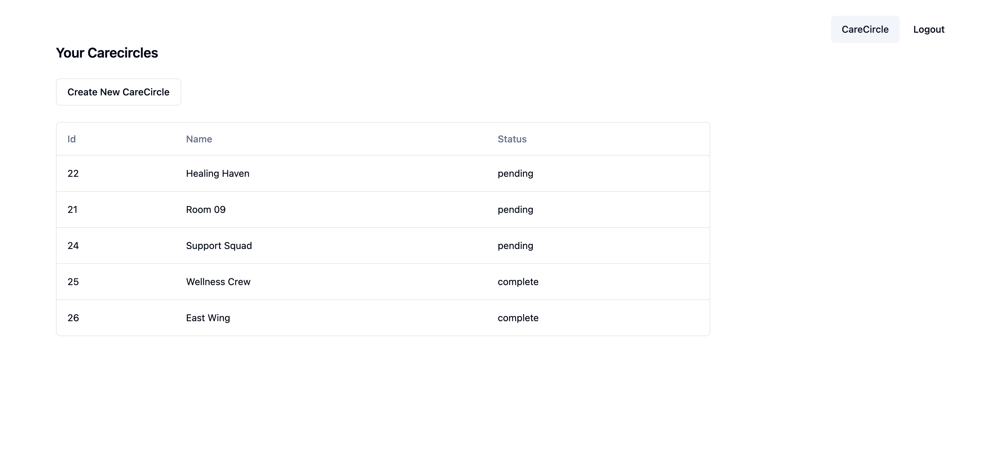
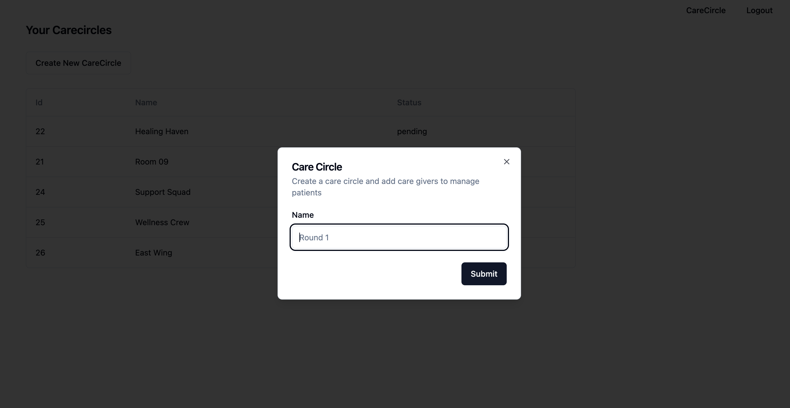
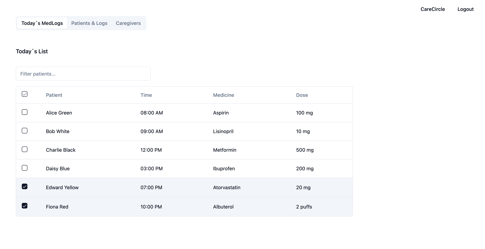

This is a [Next.js](https://nextjs.org/) project bootstrapped with [`create-next-app`](https://github.com/vercel/next.js/tree/canary/packages/create-next-app).

## Tech

Next.js, TypeScript, Radix UI

[Backend code](https://github.com/AyshaHakeem/medtrack-server)

## Overview

Medication tracking system for caregivers to manage patients within care circles. Implemented features to manage multiple care circles and to log and monitor medication schedules, dosages, and patient adherence.

## Features

- Create new carecircles
- Invite care givers
- Add patients
- Schedule medicine and dosages
- Log daily medicine intake

## Screenshots

### Care circles

### Add care circle

### Medicine Entries

### Daily List

### Care givers

